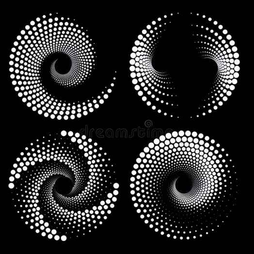

# viki_zliu0454_9103_Quiz 8

**About the Assignment**
- 0ur group chose Monet's Pacita Abad'Wheels of fortune'
- Through 'Wheels of Fortune,' I discovered that it includes particle generation, dynamic circular expansion, and spiral animation effects achieved through rotation and scaling.

## Park1
- Inspiring for your assignment:Stellar Particles and Spiral  
- In my project, the inspiration comes from cosmic art, particularly the dynamic circular and spiral patterns. These expanding circles and spirals create a sense of depth, motion, and infinity, while the use of colors further enhances the layering effect. I plan to integrate these elements into an interactive interface where the circles ripple outward, and the spirals rotate with user interaction, symbolizing the unfolding of information and exploration between content. Although challenging to implement, this technique will add dynamic visual effects, rich colors, and immersion, enhancing the flow and visual impact, making the design more engaging for users.  
- Images：Stellar Particles and Spiral
###  Image of 'Stellar Particles' & Image of 'Spiral'
  

## Park 2
- Inspiring: Stellar Particles and Spiral  
- The "Stellar Particles" system dynamically generates and controls particles using vectors and forces. ParticleEmitter emits particles outward at specific angles, with renderParticle creating expanding circles of varying sizes and opacities, mimicking cosmic motion. This technique is ideal for representing star expansion or cosmic energy effects. Similarly, the Spiral code generates rotating and scaling spirals by adjusting size, position, and rotation, simulating a ripple effect. Using transform’s rotate() and scale(), along with @keyframes, smooth continuous motion is achieved, enhancing depth, movement, and interactivity, making the experience more immersive and visually dynamic.

## Coding Technique in Action: Image or Screenshot with Example Link
### "Stellar Particles" 
- ["Inspiration Link: Stellar Particles"](https://codepen.io/sschepis/pen/ExvexL?editors=0010)  

### "Spiral"
- ["Inspiration Link: "Inspiration Link: Stellar Particles"](https://codepen.io/Tsankashvili/pen/MWMBdNO?editors=0100)  
